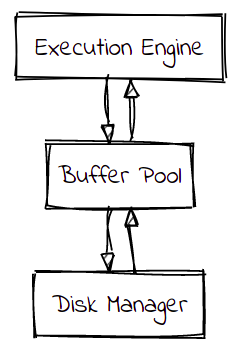

# Eggstrain

 

## **Authors: Connor, Kyle, Sarvesh**

Vectorized Push-Based inspired Execution Engine

---

# Overview

We will be taking heavy inspiration from:

- [DataFusion](https://arrow.apache.org/datafusion/)
- [Velox](https://velox-lib.io/)
- [InfluxDB](https://github.com/influxdata/influxdb)
  - which is built on top of DataFusion

---

# Our Design Goals

- Robustness
- Modularity
- Extensibility
- Forward Compatibility

---

# Features

- Encode behavior in the type system
- Provide bare minimum statistics the optimizer needs
  - Timing
  - Cardinality

---

# List of rust crates we plan to use

- `arrow`: for handling the Apache Arrow format
- `tokio`: high performance `async` runtime
- `rayon`: data parallelism crate
- `datafusion`: for the input of physical plans

---

# Design Rationale

Push vs Pull Based

| Push                                                     | Pull                                                                                                 |
| -------------------------------------------------------- | ---------------------------------------------------------------------------------------------------- |
| Improves cache efficiency by removing control flow logic | Easier to implement                                                                                  |
| Forking is efficient: You push a thing only once         | Operators like LIMIT make their producers aware of when to stop running (Headache for the optimizer) |
| Parallelization is easier                                | Parallelization is harder                                                                            |

---

# Step 1: Finalize Interfaces

Finalize API with other teams:

- I/O Service
- Catalog
- Scheduler

---

# Step 2: Implement operators in memory

- TableScan
- Filter (Completed)
- Projection (Completed)
- HashAggregation (In-Progress)
- HashProbe + HashBuild (In-Progress)
- OrderBy (Completed)
- TopN (Completed)
- Exchange
- More may be added as a stretch goal.

---

# Step 3: Buffer Pool Manager

Need to spill the data to local disk. This will be done after the first operators are implemented.

- Can potentially rip out the [`memory_pool`](https://docs.rs/datafusion/latest/datafusion/execution/memory_pool/index.html)

---

# Final Design

---

# Testing

- Unit tests for each operator
- Timing each operator's performance to benchmark our code

---

# For the sake of code quality...

- Pair programming (all combinations: KC, KS, CS)
- Unit testing for each operator
- Integrated tests across mutliple operators

---

# Example Operator Workflow

---

# Goals

- 75%: First 7 operators working + integration with other components
- 100%: All operators listed above working
- 125%: TPC-H benchmark working

---

# Stretch Goal

- Integrating with a DBMS
- Testing against TPC-H or TPC-H like workload
- Add a lot of statistics and timers to each operator (for optimizer's sake)
