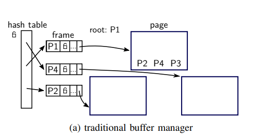
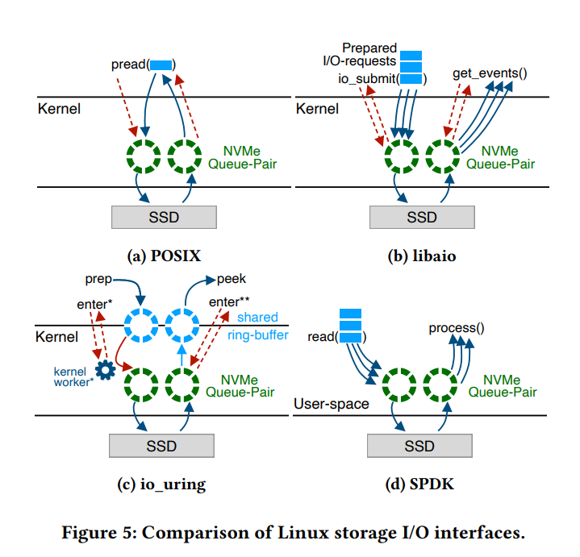

# Asynchronous Buffer Pool Manager

## **Authors: Connor, Kyle, Sarvesh**

---

# Recap: Buffer Pool Manager

A buffer pool manager manages synchronizing data between volatile memory and persistent storage.

* In charge of bringing data from storage into memory in the form of pages
* In charge of synchronizing reads and writes to the memory-local page data
* In charge of writing data back out to disk so it is synchronized

---

# Traditional Buffer Pool Manager

Traditional BPMs will use a global hash table that maps page IDs to memory frames.

* Source: _LeanStore: In-Memory Data Management Beyond Main Memory (2018)_

---

# Recap: Blocking I/O

Additionally, traditional buffer pool managers will use blocking reads and writes to send data between memory and persistent storage.

Blocking I/O is heavily reliant on the Operating System.

> The DBMS can almost always manage memory better than the OS

* Source: 15-445 Lecture 6 on Buffer Pools

---

# Recap: I/O System Calls

What happens when we issue a `pread()` or `pwrite()` call?

* We stop what we're doing
* We transfer control to the kernel
* _We are blocked waiting for the kernel to finish and transfer control back_
    * _A read from disk is *probably* scheduled somewhere_
    * _Something gets copied into the kernel_
    * _The kernel copies that something into userspace_
* We come back and resume execution

---

# Blocking I/O for Buffer Pool Managers

Blocking I/O is fine for most situations, but might be a bottleneck for a DBMS's Buffer Pool Manager.

* Typically optimizations are implemented to offset the cost of blocking:
    * Pre-fetching
    * Scan-sharing
    * Background writing
    * `O_DIRECT`

---

# Non-blocking I/O

What if we could do I/O _without_ blocking? There exist a few ways to do this:

* `libaio`
* `io_uring`
* SPDK
* All of these allow for _asynchronous I/O_

---

# `io_uring`

This Buffer Pool Manager is going to be built with asynchronous I/O using `io_uring`.

* Source: _What Modern NVMe Storage Can Do, And How To Exploit It... (2023)_

---

# Asynchronous I/O

Asynchronous I/O really only works when the programs running on top of it implement _cooperative multitasking_.

* At a high level, the kernel gets to decide what thread gets to run
* Cooperative multitasking allows the program to decide who gets to run
* Context switching between tasks is a lightweight maneuver
* If one task is waiting for I/O, we can cheaply switch to a different task!

---

# Eggstrain

The key thing here is that our Execution Engine `eggstrain` fully embraces asynchronous execution.

* Rust has first-class support for asynchronous programs
* Using `async` libraries is almost as simple as plug-and-play
* The `tokio` crate is an easy runtime to get set up
* We can easily create a buffer pool manager in the form of a Rust library crate

---

# Goals

The goal of this system is to _fully exploit parallelism_.

* NVMe drives have gotten really, really fast
* Blocking I/O simply cannot match the full throughput of an NVMe drive
* They are _completely_ bottle-necked by today's software
* If we can fully exploit parallelism in software _and_ hardware, we can get close to matching the speed of in-memory systems, while using persistent storage

---

# Proposed Design

The next slide has a proposed design for a fully asynchronous buffer pool manager. The full (somewhat incomplete) writeup can be found [here](https://github.com/Connortsui20/async-bpm).

* Heavily inspired by LeanStore
    * Eliminates the global page table and uses tagged pointers to data
* Even more inspired by this paper:
    * _What Modern NVMe Storage Can Do, And How To Exploit It: High-Performance I/O for High-Performance Storage Engines (2023)_
        * Gabriel Haas and Viktor Leis
* The goal is to _eliminate as many sources of global contention as possible_

---

---

# Some Issues

* There is a scheduler-per-thread, but no scheduler assigning tasks to specific workers (so it does not work with a multithreaded asynchronous runtime)
* The proposed design does not have a backend stage to fully synchronize I/O
* Eviction is done naively by a single worker thread
    * Deadlocks!!!
* Will probably switch to polling a list of free frames that gets populated by foreground tasks

---

# Future Work

* This will definitely not be done by the end of this semester
* Which means our execution engine is also not going to be "complete"
* Our contribution is the beginning of an implementation of an asynchronous Buffer Pool Manager in Rust
    * That can theoretically be plugged into any asynchronous execution engine like `eggstrain` or even DataFusion

---

# **Thank you!**